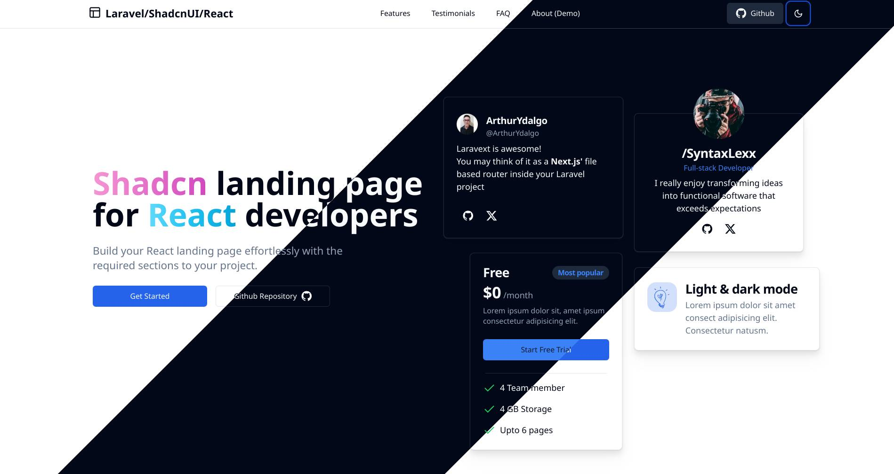

<p align="center"><a href="https://laravel.com" target="_blank"></a></p>

<p align="center">
<a href="https://github.com/syntaxlexx/laranext/actions"></a>
<a href="https://opensource.org/licenses/MIT"></a>
</p>



# Table of Contents
- [About LaraNext - The React+ShadCN-UI Starter Kit](#about-laranext---the-reactshadcn-ui-starter-kit)
- [About Laravel](#about-laravel)
- [Learning Laravel](#learning-laravel)
- [Getting Started](#getting-started)
  - [Prerequisites](#prerequisites)
  - [Installation](#installation)
  - [Running tests](#running-tests)
- [Developer Notes](#developer-notes)
  - [Todo List](#todo-list)
  - [Common Configuration files + Scripts](#common-configuration-files--scripts)
    - [Supervisor](#supervisor)
    - [Laravel Pulse](#laravel-pulse)
    - [Laravel Reverb](#laravel-reverb)
    - [Laravel Horizon](#laravel-horizon)
    - [Scheduler](#scheduler)
    - [Slack Notifications](#slack-notifications)
    - [Common Laravel Commands](#common-laravel-commands)

- [Contributing](#contributing)
  - [Credits](#credits)
- [Security Vulnerabilities](#security-vulnerabilities)
- [License](#license)


## About LaraNext - The React+ShadCN-UI Starter Kit
Laranext is a React+Shadcn starter kit for building Laravel applications. It merges the ideas portrayed in the [Laravel Inertia.js](https://github.com/inertiajs/inertia-next), [React Inertia](https://github.com/inertiajs/react-inertia), and [Nextjs](https://nextjs.org/) projects into a single starter kit. 

This kit is designed to be a lightweight and easy-to-use solution for building **beautiful**, modern, fast, **robust** and responsive web applications with Laravel and React.

>Want a vuejs version? We've got a [Kick-Starter Campaign over at Kofi](https://ko-fi.com/acelords) to help with a few development costs.

#### Features
- CI-CD via Github Actions
- ShadCN-UI React Library 
- Laravel 11 + Postgre (Neon)
- React 18 + zustand
- Social Login
- Live-Chat
- SEO mgmt
- Admin Dashboard
- Server Load Info + Application monitoring

## About Laravel

Laravel is a web application framework with expressive, elegant syntax. We believe development must be an enjoyable and creative experience to be truly fulfilling. Laravel takes the pain out of development by easing common tasks used in many web projects, such as:

- [Simple, fast routing engine](https://laravel.com/docs/routing).
- [Powerful dependency injection container](https://laravel.com/docs/container).
- Multiple back-ends for [session](https://laravel.com/docs/session) and [cache](https://laravel.com/docs/cache) storage.
- Expressive, intuitive [database ORM](https://laravel.com/docs/eloquent).
- Database agnostic [schema migrations](https://laravel.com/docs/migrations).
- [Robust background job processing](https://laravel.com/docs/queues).
- [Real-time event broadcasting](https://laravel.com/docs/broadcasting).

Laravel is accessible, powerful, and provides tools required for large, robust applications.

## Learning Laravel

Laravel has the most extensive and thorough [documentation](https://laravel.com/docs) and video tutorial library of all modern web application frameworks, making it a breeze to get started with the framework.

You may also try the [Laravel Bootcamp](https://bootcamp.laravel.com), where you will be guided through building a modern Laravel application from scratch.

If you don't feel like reading, [Laracasts](https://laracasts.com) can help. Laracasts contains thousands of video tutorials on a range of topics including Laravel, modern PHP, unit testing, and JavaScript. Boost your skills by digging into our comprehensive video library.

## Getting Started

### Prerequisites

- PHP 8.3+
- Node.js 20+
- Composer 2
- Postgres

For testing purposes, you may also use sqlite. But we **highly** encourage Postgres.
> [Neon DB](https://neon.tech/) is a serverless platform designed to help you build reliable and scalable applications faster using Postgres.

### Installation
1. Clone the repository into your **Sites** directory 
    - (Hope you're using [Laravel Herd](https://herd.laravel.com/)  or [Laravel Valet](https://laravel.com/docs/11.x/valet) to serve your sites)
```bash
git clone https://github.com/syntaxlexx/laranext.git
```
2. Copy the `.env.example` file to `.env` and update the values accordingly.
```bash
cp .env.example .env
```
3. Install the dependencies (both for PHP and Node.js)
```bash
composer install
pnpm install
```
4. Generate the application key
```bash
php artisan key:generate
```
5. Run the database migrations
```bash
php artisan migrate
```
6. Seed the database
```bash
php artisan db:seed
```
7. Refresh IDE metadata files and generate typescript types
```bash
composer ide-helper
composer generate-types
```
8. Start the development server
```bash
npm run dev
```
9. Visit the application at [http://laranext.test](http://laranext.test)

    - If you prefer to *serve* the application, you can run the following command:
  ```bash
  php artisan serve
  ```
  Remember to update the `.env` file with the correct URL values.

### Running tests
The starter-kit uses **Pest** for testing.
```bash
php artisan test

# run tests in parallel
php artisan test --parallel
```

## Developer Notes
### Todo List
- [x] Landing page
- [x] Demo pages for layout stuff
- [x] Models -> typescript generator
- [ ] Blog
- [ ] Post + Comments
- [ ] Live-chat - Laravel Reverb + Echo
- [ ] Auth pages
  - [ ] Login
  - [ ] Register
  - [ ] Reset password
  - [ ] Social Login
- [ ] Admin
  - [ ] Dashboard
  - [ ] Posts mgmt
  - [ ] Comments mgmt
  - [ ] Users mgmt
  - [ ] Profile mgmt 
  - [ ] Settings - Update .env
  - [ ] Settings - Update SEO metadata
  - [ ] Server info - Laravel Pulse
- [ ] Dashboard for Users
  - [ ] Liked Posts
  - [ ] Bookmarks
  - [ ] Posts mgmt
  - [ ] Comments
  - [ ] Profile mgmt

### Common Configuration files + Scripts
#### Supervisor
[Install supervisor](https://saywebsolutions.com/blog/installing-supervisor-manage-laravel-queue-processes-ubuntu) to automatically manage your background processes

```bash
sudo nano /etc/supervisor/conf.d/laranext-worker.conf
```

Update script

```bash
[program:laranext-worker]
process_name=%(program_name)s_%(process_num)02d
command=php /var/www/laranext/artisan queue:work redis --queue=laranext --sleep=3 --tries=3 --max-time=3600
autostart=true
autorestart=true
stopasgroup=true
killasgroup=true
user=sudouser
numprocs=2
redirect_stderr=true
stdout_logfile=/var/www/laranext/storage/logs/worker.log
stopwaitsecs=3600
```

Supervisor management

```bash
sudo supervisorctl reread
sudo supervisorctl update
sudo supervisorctl start "laranext-worker:*"
sudo supervisorctl status
```
#### Laravel Pulse
[Laravel Pulse](https://pulse.laravel.com/) is excellent in monitoring background processes.
Remember to use the `Redis` driver.

```bash
sudo nano /etc/supervisor/conf.d/laranext-pulse.conf
```

Update Script

```bash
[program:laranext-pulse]
process_name=%(program_name)s
command=php /var/www/laranext/artisan pulse:work
autostart=true
autorestart=true
user=sudouser
redirect_stderr=true
stdout_logfile=/var/www/laranext/storage/logs/pulse.log
stopwaitsecs=3600
```

Then remember to run:
```bash
sudo supervisorctl reread
sudo supervisorctl update
supervisorctl start laranext-pulse
sudo supervisorctl status
```

#### Laravel Reverb
[Laravel Reverb](https://reverb.laravel.com/) is a first-party WebSocket server for Laravel applications, bringing real-time communication between client and server directly to your fingertips.

Ensure you set the `REVERB_*` values accordingly in your `.env` file.

[Read More on it here](https://laravel.com/docs/11.x/reverb) on how to get started.

#### Laravel Horizon
[Laravel Horizon](https://laravel.com/docs/11.x/horizon#main-content) provides a beautiful dashboard and code-driven configuration for your Laravel powered Redis queues.

Ensure you set the `QUEUE_CONNECTION` as `redis` in your `.env` file.

#### Scheduler
[Auto-run commands](https://laravel.com/docs/11.x/scheduling#running-the-scheduler). The commands are run in a cronjob

```bash
crontab -e
```

Enter the following script

```bash
# Scheduler
* * * * * cd /var/www/laranext && php artisan schedule:run >> /dev/null 2>&1
```

#### Slack Notifications
Create a [Slack App here](https://api.slack.com/apps)
Bot Scopes required
- incoming webhooks
- chat:write
- channels:read
- groups:read

Also remember to go to the slack itself, create a `bot-github` channel, and run this command from chat
`/install`
Select the app to install

#### Common Laravel Commands
- `php artisan about` -> view info about your app
- `php artisan schedule:list` -> view scheduled commands
- `php artisan horizon:clear` -> delete all jobs from your application's default queue
- `php artisan horizon:clear --queue=emails` -> delete all jobs from specific queue
- `php artisan scout:flush "App\Models\Todo"` -> delete all scout indexed data
- `php artisan scout:import "App\Models\Todo"` -> recreate all scout data

```bash
php artisan scout:flush "App\Models\Todo" && php artisan scout:import "App\Models\Todo"
```

## Contributing

Thank you for considering contributing to the Laranext Starter Kit! We welcome contributions from the community.

### Credits
- [/SyntaxLexx](https://github.com/SyntaxLexx) - [Twitter](https://twitter.com/SyntaxLexx)
- [ArthurYdalgo](https://github.com/ArthurYdalgo) - [Laravext](https://laravext.dev/)
- [AceLords](https://acelords.com) - Server Resources

## Security Vulnerabilities

If you discover a security vulnerability within Laravel, please send an e-mail to SyntaxLexx via [syntaxlexx@gmail.com](mailto:syntaxlexx@gmail.com). All security vulnerabilities will be promptly addressed.

## License

- The Laravel framework is open-sourced software licensed under the [MIT license](https://opensource.org/licenses/MIT).

- The LaraNext Starter Kit is open-sourced software licensed under the [MIT license](https://opensource.org/licenses/MIT).
